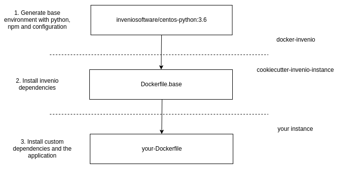

..
    This file is part of Invenio.
    Copyright (C) 2015-2018 CERN.

    Invenio is free software; you can redistribute it and/or modify it
    under the terms of the MIT License; see LICENSE file for more details.

# docker-invenio

[](https://travis-ci.org/inveniosoftware/docker-invenio/branches?branch=master) [](https://hub.docker.com/r/inveniosoftware/centos7-python/) [](https://hub.docker.com/r/inveniosoftware/centos7-python/builds/)

This repository contains Docker base images to generate the environment for
[Invenio](https://github.com/inveniosoftware/invenio) applications.

**Prerequisites** Docker: [https://docs.docker.com/install/](https://docs.docker.com/install/)


## Usage

Start by creating an Invenio instance with [cookiecutter-invenio-instance](https://github.com/inveniosoftware/cookiecutter-invenio-instance).

Among the generated files, there are two Dockerfiles [Dockerfile.base](https://github.com/inveniosoftware/cookiecutter-invenio-instance/blob/master/%7B%7Bcookiecutter.project_shortname%7D%7D/Dockerfile.base) and [Dockerfile](https://github.com/inveniosoftware/cookiecutter-invenio-instance/blob/master/%7B%7Bcookiecutter.project_shortname%7D%7D/Dockerfile),
which are used in that sequence to build the image for your application.

The complete process is depicted in the following diagram:

---


---

The last image is a ready-to-run Invenio instance. If you wish to install
extra dependencies that are not included in the Dockerfiles, you can create
a Dockerfile based on Dockerfile.base to handle the modifications.

---



---


## Development Process

Leveraging Docker image layer caching can offer a significant
speedup in your development process. This is the reason of
maintaining two Dockerfiles, a Dockerfile.base to create an image with the installed dependencies, and the final Dockerfile which installs the application code and
rebuilds the static assets, which tend to change more frequently.

In order to incorporate your latest changes, you can just repeat the last step
of the build process. For example, if you have generated an invenio project called
FunGenerator with cookiecutter-invenio-instance:

`docker build -f fun-generator/Dockerfile -t my-site .`

## Supported Tags and respective Dockerfile links

* 3.6 - [Dockerfile](https://github.com/inveniosoftware/docker-invenio/blob/master/python3.6/Dockerfile)


## Helpful resources

* [Docker Community Forums](https://forums.docker.com/)
* [Docker Community Slack](https://blog.docker.com/2016/11/introducing-docker-community-directory-docker-community-slack/)
* [Stack Overflow](https://stackoverflow.com/search?tab=newest&q=docker)
* [God himself](https://twitter.com/thetweetofgod)
* [Issue tracker](https://github.com/inveniosoftware/docker-invenio/issues)


## Automated builds

Automated builds are configured using [Docker Hub builds](https://docs.docker.com/docker-hub/builds/). The triggers are
defined the following way:

```
Branch/tag               Dockerfile                Docker tag

Push to master     ---> /python3.6/Dockerfile ---> 3.6
Push /^3\.6.*/ tag ---> /python3.6/Dockerfile ---> git-tag-name, 3.6
```

That way, we will use tag `3.6` as latest for Python version and there is also the possibility to push tags for specific use cases such as pinning certain libraries or patches.

Maintained by: [InvenioSoftware](https://github.com/inveniosoftware/)


## License

This file is part of Invenio.
Copyright (C) 2015-2018 CERN.

Invenio is free software; you can redistribute it and/or modify it
under the terms of the MIT License; see LICENSE file for more details.

